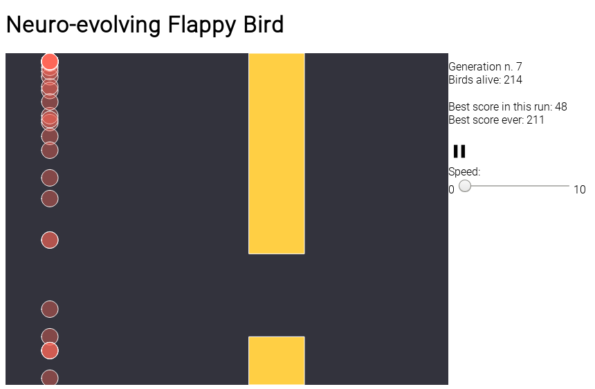

# Neuroevolving-flappy-bird
A minimalistic Flappy bird clone in which the players learn using neuroevolution. It is a browser-based app written in JavaScript, and it uses p5 for the animation rendering and TensorFlow for the operations relative to the neural network.

This project was the case study of my bachelor's thesis.
